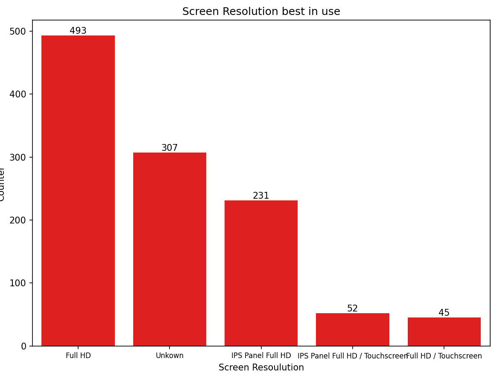

# Laptop-Prices-and-Types Analysis

## Overview
The project analyzes the laptop datasets which compares with different companies related to the laptop data sets. IT compares with the computer hardware and software resources as well as presents the facts of the data.

## Dataset
I used the datasets from the kaggle.com.
This is the original dataset in csv form:
 https://www.kaggle.com/datasets/ehtishamsadiq/uncleaned-laptop-price-dataset?select=laptopData.csv 
## Explaratory Data Analysis
But in order to do this project I have used the API to get the data source and perform the analysis.
- The features of the datasets are:
 - These were the attriputes :
    Unnamed: 0,Company,TypeName,Inches,ScreenResolution,Cpu,Ram,Memory,Gpu,OpSys,Weight,Price
 - Cleaning Steps :
   - Corrected the spelling errors.
   - Changed the data types of some field removing the string from them.
   - Created seperate column from a single column.
   - Removed empty value and not required column.

## Project Structure
 - LaptopAndPrices.py - main Script with everthing in it.
 - uncleaned_laptop  - csv file for analysis.

 - Most used operating system. (Bar Chart.)
  
 - Best in use Screen Resolution.(Bar Chart.)
  
 - Top 5 screen resolution among the Operating System (Screen Resolution)SR.(Stacked Bar Chart)
  
 - Scatter Plot showing relationship between Price and Storage. (Assumption as of now.)
  
 -  Scatter Plot showing relationship between Price and Weight.(Assumption as of now)
  

## Methodology
 - Cleaned data using pandas.
 - Visualized with seaborn and matplotlib
 - Used Api for getting the data from kaggle.
 - Created two new attribute from Memory Column, Storage and Storage Type.

## Result
 - Windows OS the most used os with count little above 1000.
 - Full HD as the widely used Screen Resolution around 400.
 - Unknwon SR being used in most of the Operating System and Full HD mostly by windows.
 - As Storage size increases Price also increases based on my assumption.
 - As Weight has increased Price has also increased based on my assumption
